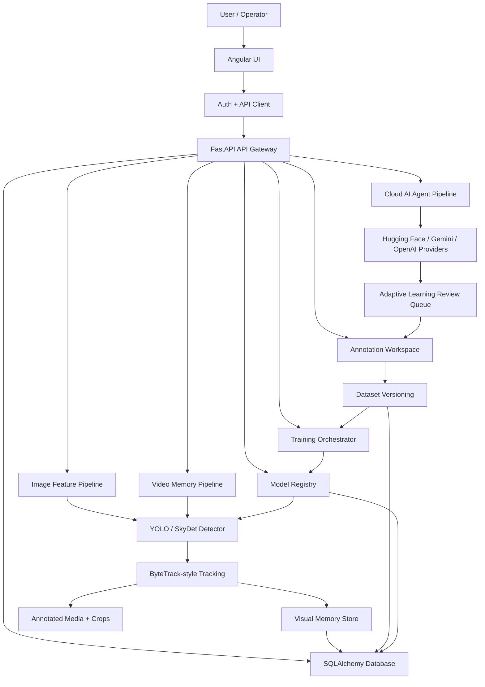

# VMS-X: Adaptive Visual Memory Intelligence Platform

VMS-X is an industry-grade FastAPI + Angular platform for full-timeline video intelligence, object tracking, visual memory, VLM-assisted open-world object naming, human-in-the-loop annotation, dataset versioning, training orchestration, and safe model registry activation.

## Core Pipeline

```text
Video/Image Upload
-> Full-frame timeline-preserving processing
-> YOLO/ONNX or SkyDet/PT detector adapter
-> ByteTrack-style tracker
-> Object crop + visual memory metadata
-> Video report + annotated output video
-> VLM-assisted adaptive learning
-> CVAT/Roboflow-style annotation workspace
-> Dataset versioning
-> Training orchestration
-> Model registry activation/rollback
```

## Project Pipeline and Workflow



### 1. User Workflow

1. The user signs in through the Angular authentication screens.
2. The dashboard routes the user into image analysis, video memory, cloud AI, annotation, adaptive review, training, or model registry tools.
3. Angular services call the FastAPI backend through typed API clients.
4. The backend returns browser-safe URLs and response DTOs, never raw host/container file paths.

### 2. Image Intelligence Workflow

1. The user uploads an image from the Image Features page.
2. FastAPI validates file type, size, and request metadata.
3. The image service sends the image to the configured detector or cloud AI provider.
4. The system normalizes detections, labels, risk values, and media references.
5. Results return to Angular as dashboard-ready feature cards, detections, and safe media URLs.

### 3. Video Memory Workflow

1. The user uploads a video and chooses processing settings.
2. The video pipeline preserves the full timeline by default.
3. Each frame is processed through the selected detector adapter, such as YOLO/ONNX or SkyDet/PT.
4. The tracker links detections across frames into stable tracked objects.
5. The service generates object crops, track summaries, visual memory metadata, reports, and annotated video output.
6. Angular displays job status, tracked objects, frame evidence, and output media.

### 4. Adaptive Learning and Annotation Workflow

1. Unknown or uncertain objects are routed into adaptive learning.
2. A VLM provider can suggest object names, summaries, or review metadata.
3. Human reviewers approve, correct, or reject the AI suggestion.
4. Approved items can move into the annotation workspace.
5. Annotation tasks produce cleaner labels for dataset creation and future model improvement.

### 5. Dataset, Training, and Model Registry Workflow

1. Reviewed annotations are grouped into versioned datasets.
2. A training job is created from the selected dataset version and training configuration.
3. Training runs asynchronously and reports status through the backend.
4. Completed model artifacts are registered in the model registry.
5. Operators can activate, deactivate, or roll back models without changing the frontend.
6. The active model feeds the next image/video detection cycle.

### 6. Backend Service Workflow

```text
Controller -> Dependency Injection -> Service -> Repository -> Database/Storage
```

- `vms_api` exposes FastAPI controllers and middleware.
- `vms_services` owns business logic, AI providers, training orchestration, and media processing.
- `vms_data_access` contains repository classes and database access boundaries.
- `vms_domain` defines database entities and SQLAlchemy setup.
- `vms_models` defines request and response DTOs.
- `vms_utils` contains shared security, middleware, validators, enums, and exceptions.

### 7. Security and Storage Workflow

1. Secrets stay in local `.env` files and Docker env files, which are ignored by Git.
2. Example env files document required configuration without exposing private tokens.
3. Uploaded media, generated crops, model artifacts, and runtime storage stay outside Git.
4. API responses expose sanitized public URLs instead of internal file paths.
5. The frontend receives only the data needed for display and user action.

## Architecture

Backend uses Python package names mapped from the requested architecture:

- `vms_data_access` = DataAccess interfaces/repositories/injection
- `vms_domain` = database/entities/migrations
- `vms_models` = all request/response DTOs, one DTO per file
- `vms_services` = interfaces/services/injection
- `vms_utils` = base, exceptions, auth policy, enums, middleware, security
- `vms_api` = controllers, configuration, middleware, dependency services, appsettings, main

Frontend uses Angular 21 standalone, feature-based architecture.

## Run with Docker

```bash
cp backend/.env.docker.example backend/.env.docker
# Set HF_TOKEN and replace JWT_SECRET_KEY in backend/.env.docker, then:
docker compose up --build
```

Backend: http://localhost:8000/docs  
Frontend: http://localhost:4200

## Local backend run

```bash
cd backend
cp .env.example .env
# Set HF_TOKEN in .env
python -m venv .venv
.venv\Scripts\activate  # Windows
pip install -r requirements.txt
python -m vms_api.main
```

Run backend tests with the development dependencies:

```bash
pip install -r requirements-dev.txt
python -m pytest -q
```

## Local frontend run

```bash
cd frontend
npm install
npm start
```

## Notes

- Default video processing is `full_video` with `max_frames=0` and `output_video_fps=0.0`, preserving original video timeline.
- Detection adapter is modular. The Video Timeline Processor lets users choose `YOLO` or `SkyDet` for the same tracking, crop, memory, report, and annotated-video pipeline. Set `YOLO_MODEL_PATH` and `SKYDET_MODEL_PATH` in `backend/.env` or Docker env to override the default model files.
- Image APIs return browser-safe media URLs. Public API responses and the Angular console never expose host or container filesystem locations.
- Cloud AI and adaptive-learning VLM requests use Hugging Face Inference Providers through the backend. Set `HF_TOKEN`, `HUGGINGFACE_VISION_MODEL`, and `HUGGINGFACE_TEXT_MODEL`; the token is never sent to the frontend.
- OpenAI and Gemini remain optional providers. Hybrid mode tries `huggingface,gemini,openai` by default.
- If Hugging Face is unavailable or unconfigured, adaptive learning safely routes the item to human review.

## Public Documentation

This README is the public project overview. Private notes and deep system-reference files stay in the local `docs/` folder and are intentionally ignored by Git.
