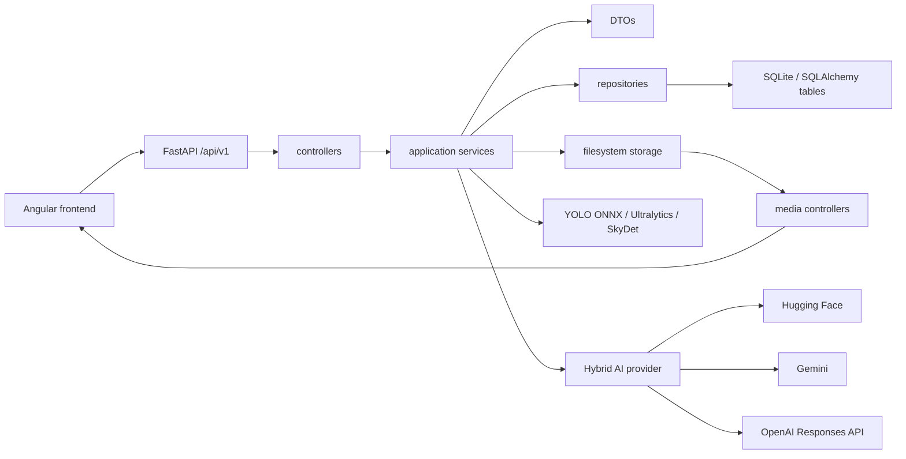

# Repository Architecture

## Relevant Folder Tree

```text
E:\VMS-X
|-- README.md
|-- DOCKER.md
|-- docker-compose.yml
|-- backend
|   |-- Dockerfile
|   |-- requirements.txt
|   |-- requirements-dev.txt
|   |-- pyproject.toml
|   |-- scripts/verify_large_tiff.py
|   |-- tests/
|   |-- vms_api/
|   |   |-- main.py
|   |   |-- appsettings.py
|   |   |-- controllers/
|   |   `-- dependency_services/
|   |-- vms_models/dtos/
|   |-- vms_domain/
|   |   |-- database/
|   |   |-- entities/
|   |   `-- migrations/
|   |-- vms_data_access/repositories/
|   |-- vms_services/
|   |   |-- services/
|   |   |-- providers/ai/
|   |   |-- interfaces/
|   |   `-- service_injection.py
|   |-- vms_utils/
|   |   |-- ai/
|   |   |-- common/
|   |   |-- middleware/
|   |   |-- security/
|   |   `-- storage/
|   `-- storage/
|       |-- auth/
|       |-- crops/
|       |-- database/
|       |-- datasets/
|       |-- frames/
|       |-- models/
|       |-- object_memory/
|       |-- outputs/
|       `-- uploads/
|-- frontend
|   |-- Dockerfile
|   |-- nginx.conf
|   |-- package.json
|   |-- proxy.conf.json
|   `-- src/app/
|       |-- app.routes.ts
|       |-- core/
|       |-- features/
|       |-- layout/
|       `-- shared/
`-- docs/
```

Generated/irrelevant folders excluded from the tree: `.git`, `.venv`, `node_modules`, `__pycache__`, `dist`, runtime cache files.

## Module Responsibilities

| Module | Responsibility |
|---|---|
| `backend/vms_api/main.py` | Creates FastAPI app, middleware, CORS, router registration, startup schema creation |
| `backend/vms_api/controllers` | HTTP route handlers and request binding |
| `backend/vms_api/appsettings.py` | Pydantic settings, storage directories, defaults |
| `backend/vms_models/dtos` | Request/response DTOs and validation constraints |
| `backend/vms_domain/entities` | SQLAlchemy entities, except `UserEntity` dataclass |
| `backend/vms_domain/database` | async SQLAlchemy engine/session and metadata schema creation |
| `backend/vms_data_access/repositories` | generic SQLAlchemy CRUD repositories plus file-backed `UserRepository` |
| `backend/vms_services/services` | application services for auth, image, video, annotation, training, model registry, media, cloud AI |
| `backend/vms_services/providers/ai` | Hugging Face, Gemini, OpenAI, hybrid provider adapters |
| `backend/vms_utils/ai` | detector adapters, SkyDet model/training, tracker, cloud prompt/parser/config utilities |
| `backend/vms_utils/common` | API response envelope and image validator |
| `backend/vms_utils/security` | PBKDF2 password hashing and HS256 JWT |
| `frontend/src/app/core` | API services, types, guards, interceptors, API config |
| `frontend/src/app/features` | Angular pages for dashboard, image features, video memory, cloud AI, annotation, adaptive review, training, registry |

## Dependency Direction

Backend controllers depend on services and DTOs. Services depend on repositories/entities, settings, detectors, and providers. Repositories depend on entities/session. Utilities are shared downward. DTOs do not call services. This direction is mostly respected, except auth uses `UserRepository` singleton directly and file-backed JSON storage outside SQLAlchemy.

Frontend feature components depend on core services/types. Core services depend on Angular `HttpClient` and `API_CONFIG`. The frontend guard/interceptor use localStorage tokens; backend route dependencies do not mirror most role constraints.

## Model, Provider, Database, And Storage Boundaries

- YOLO image path: `ImageFeatureService` uses OpenCV DNN with `YOLO_MODEL_PATH`.
- YOLO video path: `VideoMemoryService` uses `YoloDetector`, which loads Ultralytics model lazily.
- SkyDet: `SkyDetDetector` loads PyTorch checkpoint from `SKYDET_MODEL_PATH`.
- Cloud providers: no provider calls are made by controllers directly; calls route through `CloudAiAgentService` and `HybridAiProvider`.
- SQL storage: video, annotation, model, dataset, training, audit, visual-memory entities.
- JSON storage: `storage/auth/users.json`, `storage/object_memory/image_memory.json`, image dashboard history.
- Media storage: uploads/crops/frames/outputs under `backend/storage` by default.

## Architecture Diagram



## Discrepancies

- `vms_domain/migrations` contains only `__init__.py`; migration support is not implemented despite Alembic being installed.
- Stale bytecode cache references `ollama_vlm_client`, but no current `ollama_vlm_client.py` source or route exists.
- OpenAPI registers routes but almost all success response schemas are empty because route decorators omit `response_model`.
