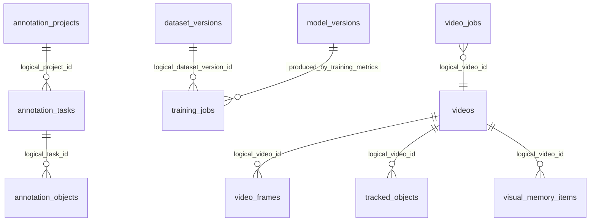

# Database And Storage

## Database Setup

Default database URL: `sqlite+aiosqlite:///backend/storage/database/vmsx.db`.

Schema creation happens at FastAPI startup via `create_database_schema()`. `backend/vms_domain/migrations` contains only `__init__.py`; Alembic migrations are not implemented.

## Tables

Common columns from `BaseEntity`: `created_at`, `updated_at`.

| Table | Primary fields |
|---|---|
| `adaptive_learning_items` | `id`, `status`, `source_type`, `source_video_id`, `stored_image_path`, YOLO/VLM/final label review fields |
| `annotation_objects` | `id`, `task_id` indexed, `label`, bbox, `geometry_type`, `points`, `status` |
| `annotation_projects` | `id`, `name`, `description`, `status` |
| `annotation_tasks` | `id`, `project_id` indexed, `source_type`, `source_path`, `status`, `frame_number` |
| `audit_logs` | `id`, `actor_user_id`, `action`, `entity_type`, `entity_id`, `metadata_json` |
| `dataset_versions` | `id`, `name`, `version`, `export_path`, `class_names`, counts, `quality_score` |
| `model_versions` | `id`, `model_name`, `model_type`, `version`, `model_path`, `onnx_path`, `class_names`, `metrics`, `status` |
| `object_identities` | `id`, `canonical_label`, `representative_memory_id`, `memory_ids`, `metadata_json` |
| `tracked_objects` | `id`, `video_id` indexed, `track_id` indexed, frame/time/class/confidence/crop/bbox |
| `training_jobs` | `id`, `dataset_version_id`, `status`, `progress_percent`, `metrics`, `output_model_path`, `error` |
| `video_frames` | `id`, `video_id` indexed, `frame_number`, `timestamp_seconds`, frame paths |
| `video_jobs` | `id`, `video_id` indexed, `status`, `progress_percent`, `message`, `error`, `result_report_path` |
| `videos` | `id`, `original_filename`, `source_video_path`, FPS/frame/duration/width/height |
| `visual_memory_items` | `id`, `video_id` indexed, `track_id` indexed, `class_name`, `confidence`, `crop_path`, `metadata_json` |

No explicit `ForeignKey` constraints were found in the SQLAlchemy column metadata; relationships are logical/string-ID based.

## User Storage

Users are not SQLAlchemy rows. `UserRepository` persists users to `storage/auth/users.json` with `user_id`, full name, email, password hash, role, active flag, and creation timestamp.

## Storage Folders

Created by settings:

- `uploads/`
- `frames/`
- `crops/`
- `outputs/video_memory_videos`
- `outputs/video_memory_reports`
- `outputs/video_memory_tracked_frames`
- `outputs/detection_reports`
- `datasets/adaptive_learning`
- `datasets/annotations`
- `datasets/exports`
- `models/`
- `logs/`
- `database/`

Additional service-created folders:

- `uploads/images`
- `uploads/cloud_ai_images`
- `uploads/video_memory_sources`
- `crops/images/{request_id}`
- `crops/video_memory_objects/{video_id}`
- `outputs/image_features`
- `outputs/training_runs`
- `datasets/custom_training/{dataset_id}`
- `object_memory/image_memory.json`

## Naming Rules

Images use UUID filenames with original extension and preserve original filename in response metadata. Video source uses `video_memory_source_{job_id}{suffix}` and preserves original filename in `VideoEntity` and result JSON.

## Temporary Vs Persistent

No clear temporary retention boundary exists. Uploads, crops, frames, reports, dashboard history, memory JSON, and cloud AI uploads are retained. There is no implemented cleanup worker.

## Docker Volumes And HF Compatibility

Docker Compose maps `./backend/storage:/app/storage` and sets `STORAGE_ROOT=/app/storage`. This is compatible with persistent filesystem volumes such as Hugging Face `/data` if `STORAGE_ROOT=/data` is supplied, but the compose file does not default to `/data`.

## ER Diagram

